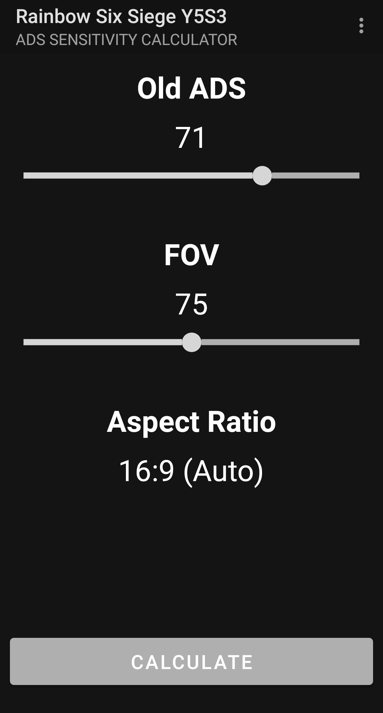
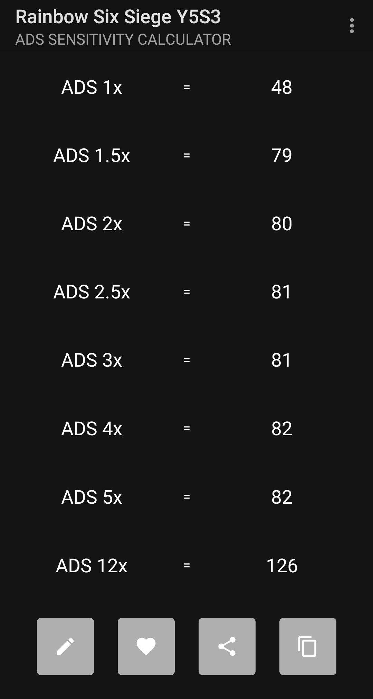

# r6adssensitivitycalculator-android

R6 Siege Y5S3 ADS Sensitivity Calculator Android application

Quick 2-hour project to calculate the new ADS sensitiviy for Tom Clancy's Rainbow Six: Siege by Ubisoft.
Not pretty but does it's job :)

## Table of Contents

- [r6adssensitivitycalculator-android](#r6adssensitivitycalculator-android)
  - [Table of Contents](#table-of-contents)
  - [Background](#background)
  - [Screenshots](#screenshots)
  - [Install](#install)
  - [License](#license)

## Background
I got the disease of changing my gaming settings every match ... :( Ubisoft changed the way ADS sensitivity is calculated and I wanted to keep my old settings I switched between. The calculator provided by Ubisoft was to hard to use for me ...

## Screenshots

## Install

[GooglePlayStore](https://play.google.com/store/apps/details?id=com.poorskill.r6adssensitivitycalculator "Rainbow Six Siege Y5S3 ADS Sensitivity Calculator on GooglePlayStore")

## License

[MIT](LICENSE) © Anton Kesy
