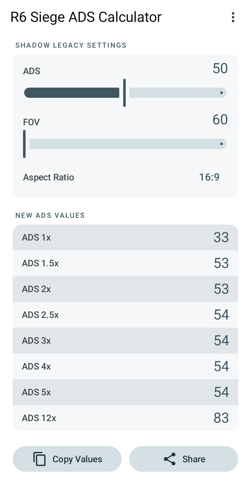
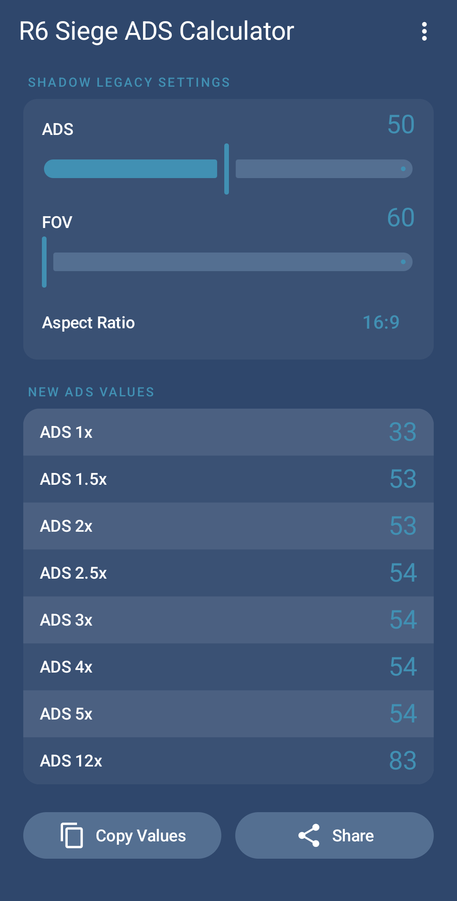

# r6adssensitivitycalculator-android

[](https://github.com/antonkesy/r6adssensitivitycalculator-android/actions/workflows/android.yml)
[](https://github.com/antonkesy/r6adssensitivitycalculator-android/actions/workflows/pre-commit.yml)
[](LICENSE)
[](https://github.com/antonkesy/r6adssensitivitycalculator-android/commits/main)

[](https://kotlinlang.org)
[](https://developer.android.com/compose)
[](https://developer.android.com/tools/releases/platforms)
[](https://play.google.com/store/apps/details?id=com.poorskill.r6adssensitivitycalculator)

R6 Siege Y5S3 ADS Sensitivity Calculator Android application

Quick 2-hour project to calculate the new ADS sensitivity for Tom Clancy's Rainbow Six: Siege by Ubisoft.
Not pretty but does it's job :)

## Table of Contents

- [r6adssensitivitycalculator-android](#r6adssensitivitycalculator-android)
  - [Table of Contents](#table-of-contents)
  - [Background](#background)
  - [Screenshots](#screenshots)
  - [Install](#install)

## Background
I have the disease of changing my gaming settings every match ... :( Ubisoft changed the way ADS sensitivity is calculated and I wanted to keep my old settings I switched between. The calculator provided by Ubisoft was to hard to use for me ...

## Screenshots

<p float="left">


</p>

## Tests

```
./gradlew testDebugUnitTest                            # everything, UI tests included
./gradlew testDebugUnitTest --tests "*.MainScreenTest" # a single class
./gradlew assembleDebug testDebugUnitTest lintDebug    # what CI runs
```

No emulator or device needed: the Compose screens are tested with [Robolectric](https://robolectric.org/)
on the JVM, so everything lives in `app/src/test` and `app/src/androidTest` is empty.
